# Taller 1: Habilitación de Linux

**Curso:** Sistemas Operativos, LEAD University
**Estudiante:** Daniel
**Entorno:** Ubuntu 26.04.1 en VirtualBox 7.2.20 (máquina virtual "Ubuntu-SO", usuario `daniel`)
**Repositorio usado:** classic-books-markdown, clonado en `/home/daniel/classic-books-markdown`

---

## Parte 1: Ejecución de Linux

Linux se ejecuta en una máquina virtual de VirtualBox con Ubuntu 26.04.1 Desktop (4 GB de RAM, 2 CPU, disco de 25 GB, red NAT). El video de la terminal ejecutando `ping www.yahoo.com` está en el archivo `Video.mp4`, incluido también en la carpeta compartida de entrega.

<video src="Screenshots/Video.mp4" controls width="720"></video>

[Ver el video](Screenshots/Video.mp4)

---

## Parte 2: Actividades en la línea de comandos

> Nota sobre la numeración: los pasos siguen el orden de las actividades del enunciado. Cada captura está en la carpeta `Screenshots` con el número del paso.

### Paso 1: `pwd`

**Comando:** `pwd`

**Respuesta:** `pwd` (print working directory) muestra la ruta completa de la carpeta donde estoy. Aquí es `/home/daniel/classic-books-markdown`, la carpeta del repositorio clonado.

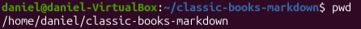

---

### Paso 2: `ls` y sus opciones

**Comando base:** `ls` lista el contenido de la carpeta actual. Los nombres con espacios se muestran entre comillas simples.

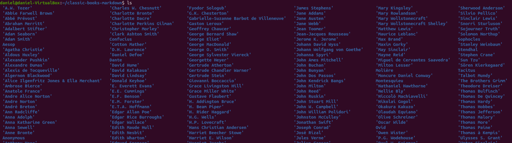

| Opción | Qué hace | Captura |
|---|---|---|
| `ls -a` | Muestra también los archivos y carpetas ocultos (los que empiezan con punto). Aparecen `.`, `..` y `.git`. | 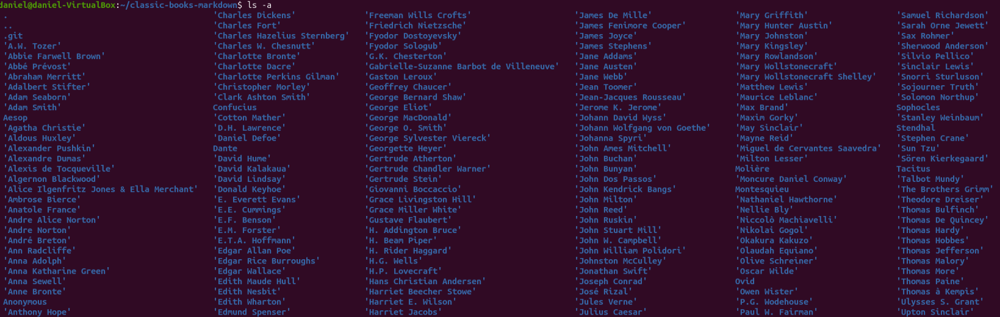 |
| `ls -al` | Formato largo (`-l`) más ocultos (`-a`): permisos, número de enlaces, dueño, grupo, tamaño en bytes, fecha y nombre. La `d` inicial indica que es un directorio. | 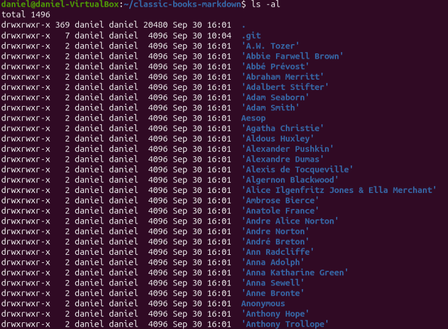 |
| `ls -d */` | Lista solo los directorios, sin mostrar su contenido. Como son 367, se limitó con `\| head -20` para la captura. | 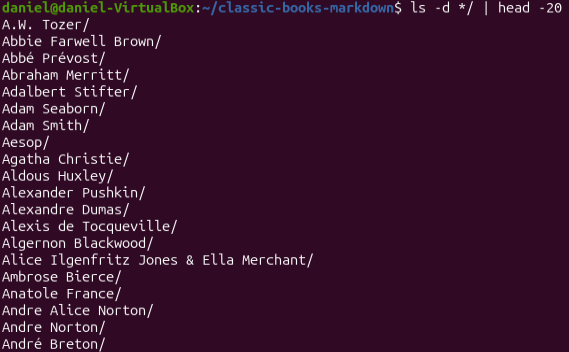 |
| `ls -F` | Agrega un símbolo al final del nombre según el tipo. Aquí `/` indica directorio. | 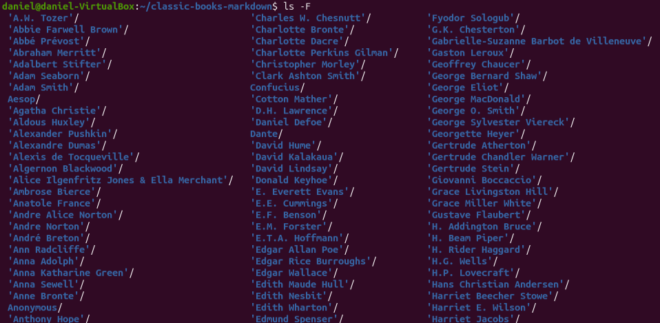 |
| `ls -lh` | Formato largo con tamaños legibles para humanos (`4.0K`, `1.5M`) en vez de bytes. | 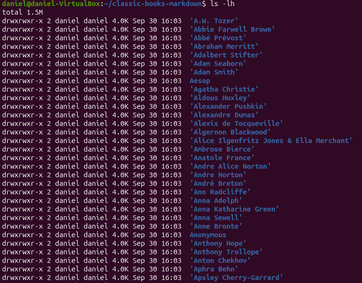 |
| `ls -t` | Ordena por fecha de modificación, de más reciente a más antiguo, en vez de por orden alfabético. | 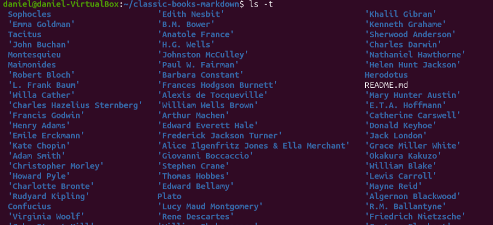 |

---

### Paso 3: `man`

**Comandos:** `man ls`, `man pwd`, `man ps`

**Respuesta:** `man` abre el manual de un comando. Se navega con flechas o espacio y se sale con `q`.

- `man ls`: lista el contenido de un directorio e ignora por defecto los que empiezan con punto. Describe opciones como `-l`, `-a`, `-h`, `-t`, `-F`.
- `man pwd`: muestra el nombre completo del directorio de trabajo actual. Tiene las opciones `-L` (lógico, respeta enlaces simbólicos) y `-P` (físico, evita enlaces).
- `man ps`: muestra una instantánea de los procesos activos. Ejemplos del manual: `ps -e` y `ps -ef` para ver todos los procesos, `ps axjf` para ver el árbol de procesos.

| `man ls` | `man pwd` | `man ps` |
|---|---|---|
| 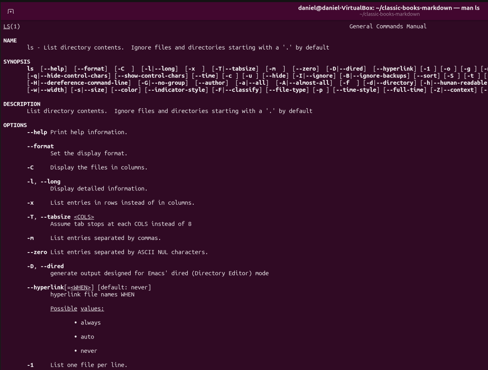 | 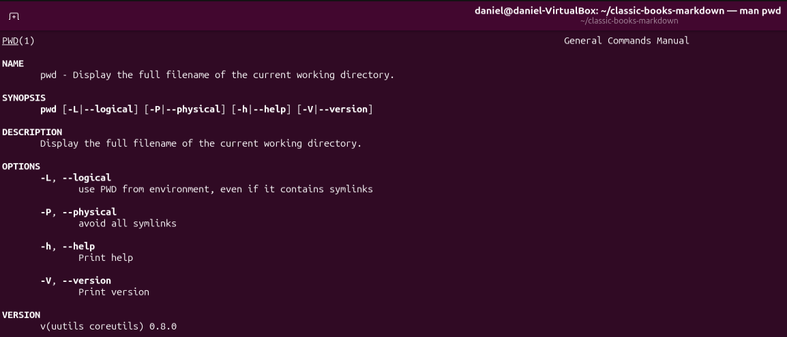 | 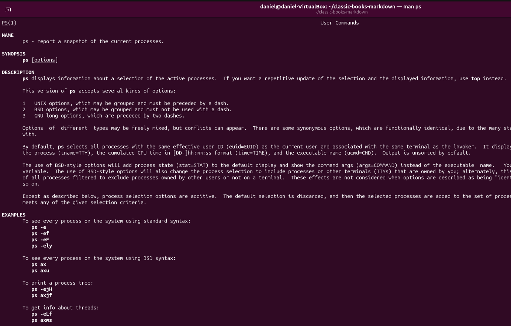 |

---

### Pasos 4 a 8: `cd`, `mkdir` y navegación

**Comandos:**

```bash
cd              # sin argumentos: va al directorio personal (home)
pwd
ls
mkdir salida    # crea el directorio salida
cd salida
pwd
cd ..           # sube un nivel
pwd
```

**Respuesta:**

- `cd` sin argumentos lleva a `/home/daniel`.
- `ls` muestra el contenido del home: `Desktop`, `Documents`, `Downloads`, `classic-books-markdown`, etc.
- `mkdir salida` crea la carpeta `salida`.
- `cd ..` sube un nivel. Desde `/home/daniel` llegó a `/home`.
- Luego regresé a `~/classic-books-markdown` y creé la carpeta `salida` dentro del repositorio, que es la que se usa de aquí en adelante (ver paso 9).

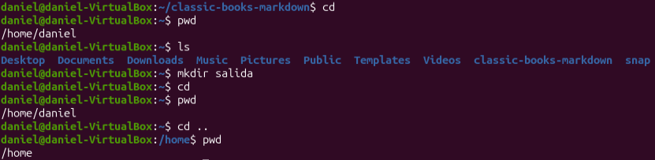

---

### Paso 9: copiar el libro de Daniel Defoe a `salida`

**Comandos:**

```bash
mkdir salida
cp "Daniel Defoe/Journal of the Plague Year.md" salida/
ls salida
```

**Respuesta:** `cp origen destino` copia un archivo. Las comillas son necesarias porque el nombre tiene espacios. El archivo real se llama *Journal of the Plague Year* (el enunciado lo escribe "Plagyue", es un error de tipeo). Después del `cp`, `ls salida` muestra el libro copiado.

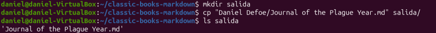

---

### Paso 10: `find` para los libros de Edgar Allan Poe

**Comandos:**

```bash
ls "Edgar Allan Poe"
find "Edgar Allan Poe" -type f -iname '*in*' -iname '*the*'
```

**Respuesta:** `find` busca archivos por criterios. `-type f` limita a archivos, y cada `-iname` filtra por nombre ignorando mayúsculas. Al poner dos, se cumplen ambos: el nombre contiene "in" y "the". Resultados:

- `A Descent into the Maelström.md`
- `The Murders in the Rue Morgue.md`

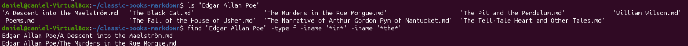

---

### Pasos 11 y 12: copiar esos libros con un solo comando

**Comandos:**

```bash
cp "Edgar Allan Poe"/*in*the*.md salida/
ls salida
```

**Respuesta:** el comodín `*` representa cualquier cadena de caracteres. El patrón `*in*the*.md` coincide con los nombres que contienen "in", luego "the", y terminan en `.md`. El comodín va fuera de las comillas, porque dentro de ellas el shell no lo expande. Tras el `cp`, `salida` contiene los tres libros: *A Descent into the Maelström*, *Journal of the Plague Year* y *The Murders in the Rue Morgue*.

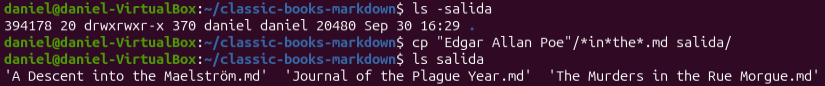

---

### Pasos 13 y 14: entrar a `salida`, verificar y contar

**Comandos:**

```bash
cd salida
pwd
ls | wc -l
```

**Respuesta:** `cd salida` entra a la carpeta y `pwd` confirma `/home/daniel/classic-books-markdown/salida`. `ls | wc -l` cuenta los archivos: `|` envía la salida de `ls` a `wc -l`, que cuenta líneas. Con los tres libros copiados da **3**.

La captura se tomó más tarde, con `salida` ya con más archivos (`ip.txt`, `lista.txt` y `resultados-busqueda.txt`), y muestra el listado largo de la carpeta. El prompt confirma que estoy en `.../classic-books-markdown/salida`.

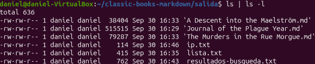

---

### Paso 15: redirección con `>`

**Comandos:**

```bash
ls -al > lista.txt
ls | wc -l
```

**Respuesta:** `>` manda la salida de un comando a un archivo en vez de la pantalla. Crea el archivo, o lo sobrescribe si ya existe. El primer comando no imprime nada. El segundo conteo da **4**, porque ahora existe `lista.txt` además de los tres libros.

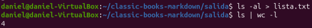

---

### Paso 16: `view`

**Comando:** `view lista.txt`

**Respuesta:** `view` abre el archivo en el editor vi en modo solo lectura, de modo que no se puede modificar por accidente. Se sale con `Esc` y luego `:q!` + Enter. Se observa que `lista.txt` aparece con tamaño 0: la redirección crea el archivo antes de que `ls` corra, así que `ls` lo listó cuando todavía estaba vacío.

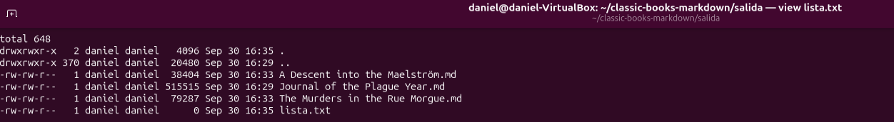

---

### Paso 17: `less` y `cat`

**Comandos:**

```bash
less "Journal of the Plague Year.md"
cat lista.txt
```

**Respuesta:**

- `less` muestra un archivo largo por pantallas y permite navegar con flechas, espacio y `b`, buscar con `/palabra` y salir con `q`. No carga todo el archivo ni lo modifica. Se usó con el libro de Defoe.
- `cat` imprime el archivo completo de una vez. Sirve para archivos cortos como `lista.txt`.

| `less` | `cat` |
|---|---|
| 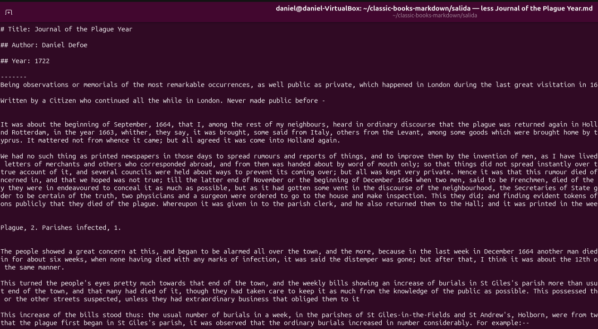 | 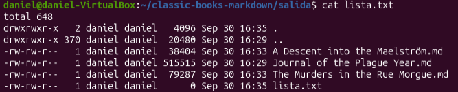 |

---

### Paso 18: `cat *.txt | grep Scotland`

**Comandos:**

```bash
cat *.txt | grep Scotland     # literal del enunciado
cat *.md | grep Scotland      # variante útil
```

**Respuesta:** `cat` junta el contenido de los archivos que coinciden con el comodín y `grep Scotland` deja solo las líneas que contienen esa palabra.

- Con `*.txt` no aparece nada: el único `.txt` es `lista.txt`, que no contiene "Scotland". Los libros son archivos `.md`.
- Con `*.md` aparece una línea del libro de Defoe, con "Scotland" resaltada en rojo.

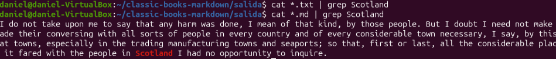

---

### Paso 19: `grep` y pipe, guardando el resultado

**Comandos:**

```bash
cat *.md | grep Scotland > resultados-busqueda.txt
wc -l resultados-busqueda.txt
cat resultados-busqueda.txt
```

**Respuesta:** combina `|` (pipe) para encadenar comandos y `>` para guardar el resultado. `wc -l` confirma que se guardó **1** línea, y `cat` muestra que es la misma que se vio en el paso 18.

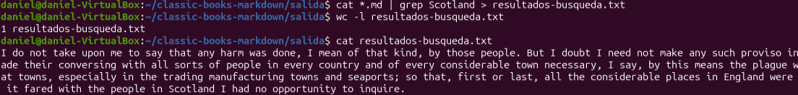

---

### Paso 20: búsquedas propias

**Comandos:**

```bash
cat *.md | grep -i London | head
cat *.md | grep -ci plague
cat *.md | grep -i "Rue Morgue" | head -5
```

**Respuesta:**

- `grep -i London`: `-i` ignora mayúsculas y minúsculas. `head` limita la salida a las primeras 10 líneas. Devuelve frases del libro de Defoe que mencionan Londres.
- `grep -ci plague`: `-c` cuenta las líneas que coinciden en lugar de mostrarlas. Resultado: **190** líneas contienen "plague" en los tres libros.
- `grep -i "Rue Morgue" | head -5`: busca una frase con espacio, por lo que va entre comillas. Devuelve las primeras 5 líneas, que corresponden al cuento de Poe.

| Búsqueda de "London" | Búsquedas de "plague" y "Rue Morgue" |
|---|---|
|  |  |

---

### Paso 21: tabla de comandos

| Comando | Descripción (en mis palabras) | Ejemplo propio |
|---|---|---|
| `pwd` | Me dice en qué carpeta estoy parado. | `pwd` |
| `ls -lh` | Lista los archivos con detalles y tamaños fáciles de leer. | `ls -lh salida` |
| `ls -a` | Lista todo, incluyendo lo oculto. | `ls -a ~` |
| `cd` | Me mueve a otra carpeta; sin argumentos, me lleva al home. | `cd ..` |
| `mkdir` | Crea una carpeta nueva. | `mkdir pruebas` |
| `cp` | Copia un archivo a otro lugar o con otro nombre. | `cp lista.txt copia.txt` |
| `find` | Busca archivos según su nombre, tipo u otros criterios. | `find . -iname '*raven*'` |
| `grep` | Muestra solo las líneas que contienen un texto. | `grep -i london *.md` |
| `wc -l` | Cuenta cuántas líneas tiene un archivo o una salida. | `wc -l lista.txt` |
| `cat` | Imprime un archivo completo o junta varios. | `cat lista.txt` |
| `less` | Permite leer un archivo largo por partes. | `less resultados-busqueda.txt` |
| `head` | Muestra las primeras líneas de algo. | `head -n 5 lista.txt` |
| `>` | Guarda la salida de un comando en un archivo. | `date > fecha.txt` |
| `\|` | Pasa la salida de un comando como entrada del siguiente. | `ls \| wc -l` |
| `man` | Abre el manual de un comando. | `man grep` |
| `ip addr` | Muestra las interfaces de red y sus direcciones. | `ip addr` |

---

### Paso 22: dirección IP con `grep`, guardada en un archivo con un solo comando

**Comandos:**

```bash
ip addr | grep "inet " > ip.txt
cat ip.txt
```

**Respuesta:** `ip addr` muestra las interfaces de red. `grep "inet "` deja solo las líneas con direcciones IPv4 (el espacio evita las de IPv6). `> ip.txt` guarda el resultado, todo en un único comando. El contenido muestra:

- `127.0.0.1/8` en la interfaz `lo` (loopback, la propia máquina).
- **`10.0.2.15/24`** en la interfaz `enp0s3`: la dirección IP de la máquina virtual, asignada por la red NAT de VirtualBox.

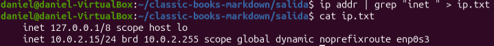